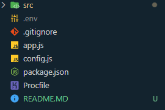
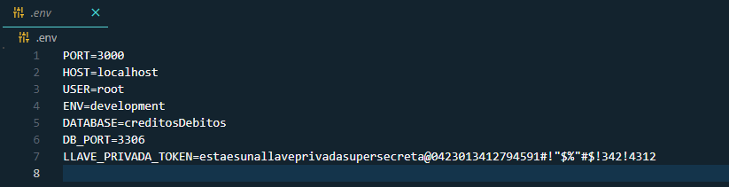
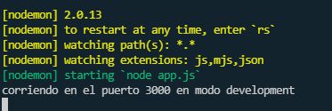
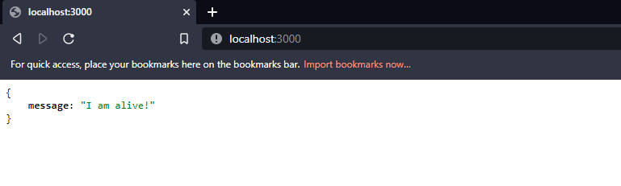

# NodeJS CRUD 💚
## _Taller, IA UNAH 💻_

Ejemplo práctico API REST nodeJS y expressJS 

- Mysql
- Procedimientos almacenados
- Encriptación
- JWT(json web token)
- Middlewares
- Variables de entorno

## Características 🌟

- Conexión a Mysql
- Consumo de procedimientos almacenados
- Encriptación y desencriptación de contraseña al crear usuario e iniciar sesión.
- Middleware validar JWT
- Validación de datos 

## Instalaciones 💻🔎

Instalar los siguientes componentes:

- [NodeJS](https://nodejs.org/) - Versión lts
- [VS Code](https://code.visualstudio.com/) - O cualquier editor de código o IDE de su preferencia.
- [Git](https://git-scm.com/) - Control de versiones.
- [Postman](https://www.postman.com/) - Probar API's.

## Correr aplicación 🚀


Clonar repositorio en cualquier ruta de su computadora.

```sh
git clone https://github.com/fabriciogonzalez06/nodeJs_IA_Taller_UNAH.git
```

Agregar un archivo .env en el directorio raíz de la aplicación



Agregar las variables de entorno siguientes con los valores requeridos y su configuración de base de datos.



```sh
PORT=3000
HOST=localhost
USER=root
ENV=development
DATABASE=nombrebasededatos
DB_PORT=3306
LLAVE_PRIVADA_TOKEN=estaesunallaveprivadasupersecreta@0423013412794591#!"$%"#$!342!4312
```

Instalar las dependencias del proyecto estando en el directorio raíz desde la terminal, se deberá crear la carpeta node_modules con todas las dependencias del proyecto.

```sh
npm install
```

Instalar nodemon de manera global

```sh
npm install -g nodemon
```

Correr la aplicación en modo desarrollo

```sh
npm run start:dev
```

Correr la aplicación 

```sh
npm  start
```

Deberá ver un mensaje en consola diciendole el puerto y modo en que  se esta ejecutando la aplicación



Puede irse al navegador y digitar el puerto en que esta corriendo la aplicación ejem localhost:3000, deberá ver un mensaje como el siguiente: 




(_OPCIONAL_) Remover repositorio y agregar su propio repositorio para subir la app a su repositorio de código favorito. 

En la raíz del proyecto en la terminal(si usa windows preferiblemente use la powershell) digite
```sh
rm -R .git
```

Con esto ya podrá agregar su repositorio y subir el código.


## Dependencias del proyecto 💪

Dependencias utilizadas en el proyecto y su caso de uso.

| Dependencia | Descripción |  Link |
| ------ | ------  | ------ |
| ExpressJs | Enrutador para las API's | [expressJs](https://www.npmjs.com/package/express) |
| Mysql | Driver para conectar a bases de datos Mysql y MariaDB | [jsonwebtoken](https://www.npmjs.com/package/mysql) |
| Bcrypt | Encriptar datos(Encriptar y desencriptar contraseña) | [bcrypt](https://www.npmjs.com/package/bcrypt) |
| Dotenv | Cargar variables de entorno desde un archivo .env | [dotenv](https://www.npmjs.com/package/dotenv) |
| Joi | Validador esquema de objetos | [joi](https://www.npmjs.com/package/joi) |
| Dotenv | Cargar variables de entorno desde un archivo .env | [dotenv](https://www.npmjs.com/package/dotenv) |
| Jsonwebtoken | Generar y validar JWT | [jsonwebtoken](https://www.npmjs.com/package/jsonwebtoken) |


## License

MIT
